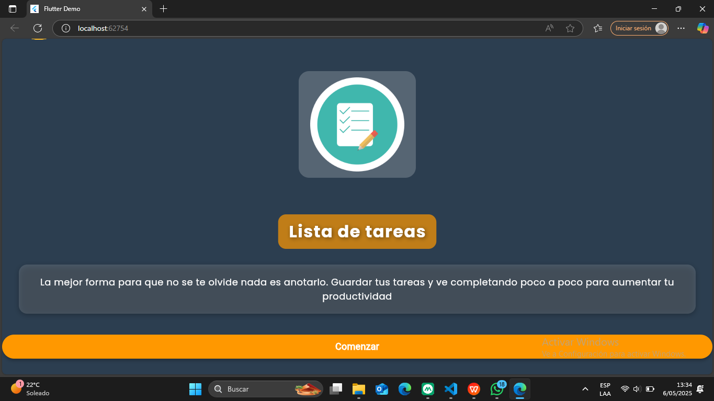
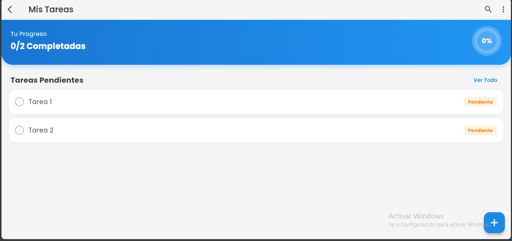

 TaskApp - Aplicación de gestión de tareas

Este repositorio contiene una aplicación de Flutter para gestión de tareas, desarrollada como parte del Laboratorio 7 de programación multiplataforma.

## Capturas de pantalla

<p align="center">
  
  
</p>

## Requisitos previos

Para poder ejecutar esta aplicación necesitas:

- [Flutter](https://flutter.dev/docs/get-started/install) (versión 3.0 o superior)
- [Git](https://git-scm.com/downloads)
- Un editor de código como [Visual Studio Code](https://code.visualstudio.com/) con las extensiones de Flutter y Dart

## Cómo implementar el proyecto

### 1. Clonar el repositorio

```bash
git clone https://github.com/OsCAR0367/laboratorio07flutter.git
cd laboratorio07flutter
```

### 2. Obtener las dependencias

```bash
flutter pub get
```

### 3. Ejecutar la aplicación

```bash
# Para ejecutar en modo debug
flutter run

# Para compilar y ejecutar en un dispositivo específico
flutter run -d <nombre-del-dispositivo>

# Para ver lista de dispositivos disponibles
flutter devices
```

### 4. Compilar la aplicación para producción (opcional)

```bash
# Para Android
flutter build apk --release

# Para iOS (requiere macOS)
flutter build ios --release
```

## Funcionalidades de la aplicación

La aplicación de lista de tareas ofrece las siguientes características:

1. **Página de inicio (Splash)** - Una introducción visual con un botón "Comenzar" para acceder a la aplicación.

2. **Gestión de tareas**:
   - Ver lista de tareas pendientes
   - Añadir nuevas tareas
   - Marcar tareas como completadas
   - Eliminar tareas mediante deslizamiento

3. **Seguimiento de progreso**:
   - Indicador visual del porcentaje de tareas completadas
   - Contador de tareas realizadas

## Estructura del proyecto

La estructura principal del proyecto es:

- main.dart - Punto de entrada de la aplicación
- app.dart - Configuración principal de la app
- task.dart - Modelo de datos para tareas
- view
  - splash_page.dart - Página de inicio/bienvenida
  - task_list_page.dart - Página principal con la lista de tareas
  - `components/` - Componentes reutilizables

## Flujo de uso

1. Al iniciar la aplicación, se muestra una pantalla de bienvenida con una breve descripción y un botón para comenzar.
2. Al hacer clic en "Comenzar", se navega a la página principal de tareas.
3. En la página de tareas, se muestra un resumen del progreso y la lista de tareas actuales.
4. Para añadir una nueva tarea:
   - Pulsa el botón flotante "+" en la esquina inferior derecha
   - Ingresa la descripción de la tarea en el campo de texto
   - Pulsa "Guardar" o presiona Enter

5. Para marcar una tarea como completada o pendiente:
   - Toca el ítem de la tarea

6. Para eliminar una tarea:
   - Desliza la tarea de derecha a izquierda

## Personalización

Si deseas personalizar la aplicación, puedes modificar:

- Los colores principales en app.dart
- Los estilos de texto y componentes visuales
- Agregar funcionalidades adicionales como fechas de vencimiento o categorías

## Contribución

Si deseas contribuir a este proyecto, por favor:

1. Haz un fork del repositorio
2. Crea una nueva rama (`git checkout -b feature/nueva-funcionalidad`)
3. Realiza tus cambios
4. Envía un Pull Request

## Licencia

Este proyecto está disponible como código abierto bajo los términos de la licencia MIT.